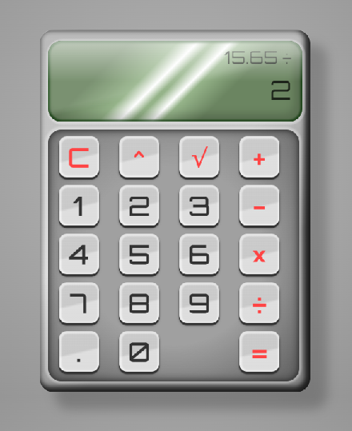

# Calculator

View live demo: https://jcrachael.github.io/tod-calculator/

The Odin Project Foundations course Calculator project: https://www.theodinproject.com/lessons/foundations-calculator

A JavaScript-based calculator that performs addition, subtraction, multiplication, division, exponential and square root functions.

------------------------------------------------------------------------------------------------

Last modified: 22 October 2022